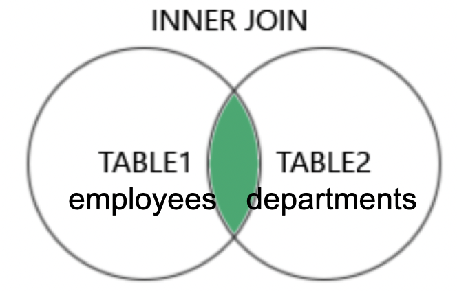
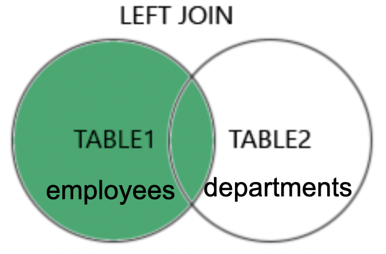
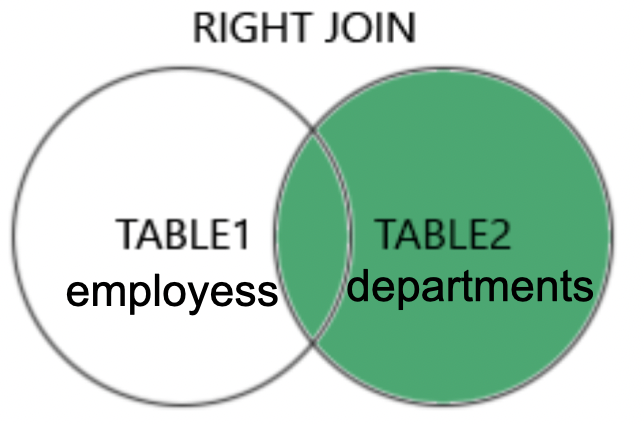

# Mandatory I - Tech Company

**Deadline**: This is mandatory I and the deadline is in Teams. Mandatories are prerequisites to go to the exam.

**Hand-in**: `itslearning`, hand in a link to the SQL file in any Git repository. There will be peer assessment after the deadline. 

Late hand-ins are only accepted the Assignment channel in the Teams room.

Solve these exercises to your best ability.

For the JOIN assignments you are more than welcome to solve the exercises together.

Remember, the goal is not that you solve all the assignments perfectly but that you struggle with figuring it out. Don't use LLM for solving because I have no use of perfectly generated soltuions. The goal is for you to learn, not what you hand in.

You are welcome to ask in the `Questions` Teams channel if you are stuck on an assignment.

---

# Welcome to the company!

You have been hired as a DBA (Database Administrator). A DBA is responsible for managing and maintaining the database systems of the organization, ensuring their performance, security, and availability. One key role is to decide who gets access to what data. If a person needs more access to data they must come to you and ask for it. 

---

## Cheatsheet

#### INNER JOIN

```sql
SELECT *
FROM table_1
INNER JOIN table_2
    ON table_1.id = table_2.id
```

#### LEFT (OUTER) JOIN

```sql
SELECT *
FROM table_1
LEFT JOIN table_2
    ON table_1.id = table_2.id
```

#### RIGHT (OUTER) JOIN

```sql
SELECT *
FROM table_1
RIGHT JOIN table_2
    ON table_1.id = table_2.id
```

---

## Preparation

Run the script [tech_company.sql](./tech_company.sql) against a new database named `tech_company`. Then write your SQL queries in the MySQL CLI or DataGrip or similar. 

Solve the assignment by writing the SQL queries below each question. You can do that by wrapping the SQL code with:

\```sql

SQL CODE HERE

\```

---

## Single Table Assignments


Let's start with a couple of simple tasks to get you adjusted to your new role.

1. Find the employee number for employees named `MARTIN`.

2. Find the employee(s) with a salary greater than 1500.

3. List the names of salesmen that earn more than 1300.

4. List the names of employees that are not salesmen.

5. List the names of all clerks together with their salary with a deduction of 10%.

6. Find the name of employees hired before May 1981.

7. List employees sorted by salary in descending order (i.e. highest salary first).

8. List departments sorted by location.

9. Find name of the department located in New York.

10. You have proven your worth at the company. Your colleague comes to you trying to remember `what's-his-name`. It starts with a `J` and ends with `S`. Can you help her?

11. Maybe that wasn't helpful. "Oh yeah, I remember now!" they say and tell you that he is a manager.

12. How many employees are there in each department?

<details> 
  <summary>Second Hint. Don't click unless absolutely stuck.</summary>
   Use GROUP BY.
</details>


---

## Aggregate functions

1. For the first assignment, take on the hat of a Data Analyst. You've been tasked to create a summary of interesting data. 

Use `MIN`, `MAX`, `AVG`, `SUM`, `ORDER BY`, `BETWEEN` and more.

If you in this task manage to solve one of the next assignments, then pat yourself on the back! You are a valued employee at tech company. 

2. List the number of employees.

3. List the sum of all salaries (excluding commission).

4. List the average salary for employees in department 20.

5. List the unique job titles in the company.

6. List the number of employees in each department.

7. List in decreasing order the maximum salary in each department together with the department number.

8. List total sum of salary and commission for all employees.

--- 

## JOIN Assignments

1. Create an `INNER JOIN` between `employees` and `departments` to get the department name for each employee. Show all columns.



2. Continue from the last task. Show two columns. The `employee_name` and their corresponding `department_name`. Oh, and can you sort them alphabetically (A-Z)?

3. Now is the time to make a LEFT JOIN. Let's look at `employee_name` and `department_name` only. There is one more person this time who didn't show in the previous query. Who is it and why?



4. Consider this query:

```sql
SELECT departments.department_name, COUNT(employees.employee_number)
FROM employees
JOIN departments
    ON departments.department_number = employees.department_number
GROUP BY department_name;
```

One department is missing. Which one and why? (Look in the database).

5. To get the missing department change the previous query to use a RIGHT JOIN.



6. `SCOTT` sends you this query and asks you to run it. In order to assess whether it is information that `SCOTT` is privy to, you must first understand it. Describe in technical terms what this query does:

```sql
SELECT *
FROM employees employee
JOIN employees manager
    ON employee.manager_id = manager.employee_number
ORDER BY employee.employee_name;
```

7. Get two columns: employees and their managers.

8. Use the `HAVING` keyword (feel free to look it up) to show the departments with more than 3 employees. The `as number_of_employees` is so that you can reference the value later on in the query:

```sql
SELECT employees.department_number, COUNT(employees.department_number) as number_of_employees
FROM employees
GROUP BY department_number;
```

9. Subquery time! Select the name and salary of employees whose salary is above average: `WHERE salary > (SELECT AVG(salary) FROM employees)`


---

## Join Table (Many-to-many)

1. Create a new table called  `leaders` and insert rows into it.

2. Create a new table called `employees_leaders` that should link the `employees` and `leaders` tables. This is called a join table. It will enable you to create a many-to-many relationship between employees and leaders (a leader can manage multiple employees and an employee can have multiple leaders). Try to figure it out yourself, otherwise here is the solution:

<details>
  <summary>Spoiler</summary>
  ```sql
CREATE TABLE employees_leaders (
    employee_number INT,
    leader_number INT,
    PRIMARY KEY (employee_number, leader_number),
    FOREIGN KEY (employee_number) REFERENCES employees(employee_number),
    FOREIGN KEY (leader_number) REFERENCES leaders(leader_number)
);
```
</details>

3. Create rows in `employees_leaders` that link employees to their respective leaders.

4. Create a many-to-many query between employees and leaders. It requires two JOIN statements. First you select from `employees`, then you join with `employees_leaders`, and finally you join again with `leaders`.