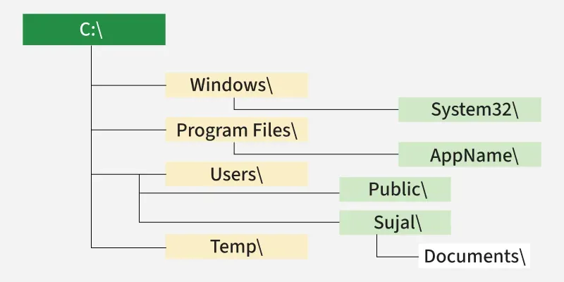

    <h1>File systems (Linux vs. Windows)</h1>

---

# Linux File System

The Linux File System will differ depending on the distro used but it often looks like:

[Source](https://fireship.io/courses/linux/basics-file-system/)

*How many users are there? Where is the user folder?*

*I am inside of the `bob` home directory. Tell me how to go to `alice` home directory?*

*I am in root and I want to go down to `/bin` in `/local`.*

---

# Linux File System - Purpose of each standard folder

---

# Windows File System

[Source](https://www.geeksforgeeks.org/ethical-hacking/windows-file-system-structure/)

*I am in the `C:\` drive and I want to check out what programs have been installed. How do I get there?*

*I am in the `C:\` drive and I want to check out Sujal's Documents. How?*

*I am inside of `System32` and I want to go to the public folder. How?*

---

# *nix: Everything is a file

## Warning, this and the next are difficult slide for the *real* techies

`*nix` is the family of OS that includes Unix, Linux and MacOS.

[Everything is a file](https://en.wikipedia.org/wiki/Everything_is_a_file)

---

# Windows and its many terminals

- `cmd`: does **not** support what you are learning. 

- `Powershell`: aliases many *nix-type commands, which means that under the hood it runs cmdlets that return `.NET` objects (like `Get-ChildItem` = `ls`, `Get-Process` = `ps`, `Get-Content` = `cat`)

- `Git Bash`: provides POSIX environment that only aliases when necessary.

- `Cygwin`: a large collection of GNU and Open Source tools which provide functionality similar to a Linux distribution on Windows.

* `Windows Subsystem for Linux` (`WSL`): provides a *nix experience by running a Linux distribution.
