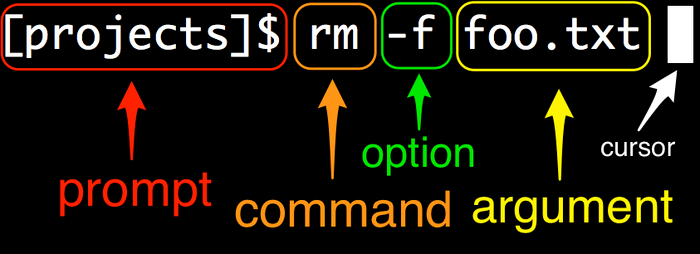

<div class="title-card">
    <h1>Terminal Commands</h1>
</div>

---

# The most important rule! TAB TAB TAB TAB

Use tab to auto-complete commands and file names.

This will not only help you save time in typing but guide you and inform you when you are mistyping.

You can cycle through previous commands with the `ARROW UP` and `ARROW DOWN` keys.

---

# Open your terminals

Windows users open `Git Bash`. That's what you will use this semester. 

Other users can use their preferred terminal.


---

# Anatomy of the Command Line Interface (CLI)

*What do you see when you open your terminal? What does the information tell you?*

---

# Prompts, commands, options/flags, arguments and cursors



[Source](https://www.learnenough.com/command-line-tutorial)

**Meta-note**: In the course materials, when you see a dollar sign `$` in documentation, it indicates that the command should be run in a terminal. You should not copy the dollar sign itself when entering commands. Example:

```bash
$ ls
```

Other notabble prompt characters: `>` or `$` or `#`.

---

# Who am I? Where am I?

Who am I:

```bash
$ whoami
```

Where am I (**p**rint **w**orking **d**irectory):

```bash
$ pwd
```

---

# List

Find out where you are (print working directory).

List files:

```bash
$ ls
```

List files with `l` (long format) and `a` (all, including hidden files/folders):

```bash
$ ls -la
```

*What is `.`?*

*What is `..`?*

*How can you find out?*

---

# Change Directory `cd`

```bash
$ cd <directory>
$ cd ..
```

*What do you think `cd .` does?*

---

# Exercise - From tip to toe

1. Move to the lowest directory that you can.

2. Move to the highest directory that you can.

You are not allowed to use `cd /`.

---

# Make and remove a directory

Make a directory:

```bash
$ mkdir <directory>
```

Remove a directory:

```bash
$ rmdir <directory>
```

---

# Say something nice

And show the people around you:

```bash
$ echo "You are doing great"
```

---

# Create a file

See what is inside a file (concatenate):

```bash
$ cat <file_name>
```

Different ways to create a file:

```bash
$ touch <file_name>
$ echo "Hello, World" > <file_name>
$ echo "Hello back to you" >> <file_name>
$ echo "Hello hello" > <file_name>
```

*What does each command do? Use `cat` after each command to inform your answers.*


---

# Delete what you've created so far

You can delete one or multiple files at once:

```bash
$ rm <file_name>
$ rm <file_name> <another_file_name> <yet_another_file_name>
```

It will not work with directories because one command could end up deleting a lot of files.

That's why you have to specify that you want to delete a directory with the `-r` (*recursive*) option:

```bash
$ mkdir <directory_name>
$ rm -r <directory_name>
```

You can add the `-f` (force) option to delete a directory without being prompted for confirmation: `-rf`. 

---

# Rename and copy

*Watch me do the following*:

Rename a file/directory (move):

```bash
$ mv <old_file_name> <new_file_name>
$ mv <old_directory_name> <new_directory_name>
```

Copy a file/directory:

```bash
$ cp <source_file_name> <destination/file_name>
$ cp -r <source_directory_name> <destination/directory_name>
```

---

# Get Help

Often you can get a help menu by adding the `--help` flag to a command. For example:

```bash
$ ls --help
```

Outside of Windows you can run the **man pages** (manual) with:

```bash
$ man ls
```

To quit from the manual press `q`.

[Command Overview](https://courses.cs.washington.edu/courses/cse390a/14au/bash.html)

---

# What do the following commands do?

*Nix users can use `Man Pages` while Windows users can look it up online:

```bash
$ wc
$ uniq
$ sort
```

**Hint**: They are all able to take a file as an argument.
