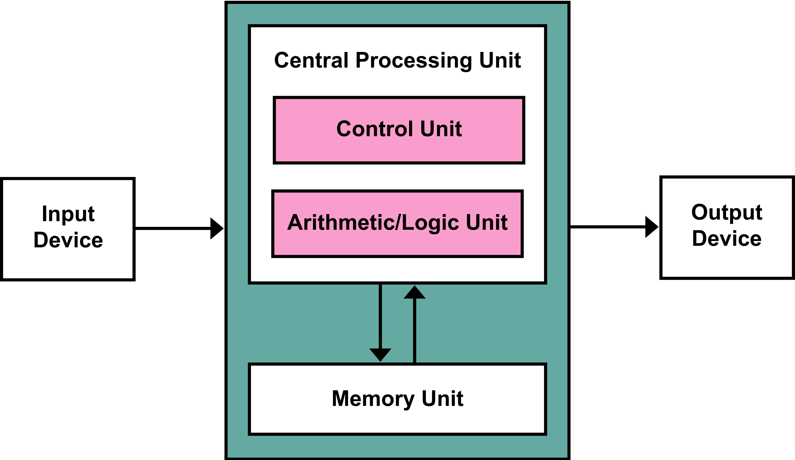

    <h1>Hardware</h1>

---

# What components do you know?

*And what do they do?*

---

# Von Neumann Architecture

[Source](https://en.wikipedia.org/wiki/Von_Neumann_architecture)

---

# CPU Architecture

---

# Fetch, Decode, Execute

Each instruction is one clock cycle. 

1hz = 1 cycle per second

My computer is 3.5 GHz = 3.5 billion cycles per second
