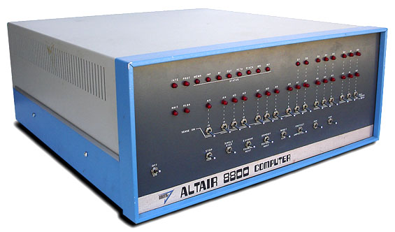
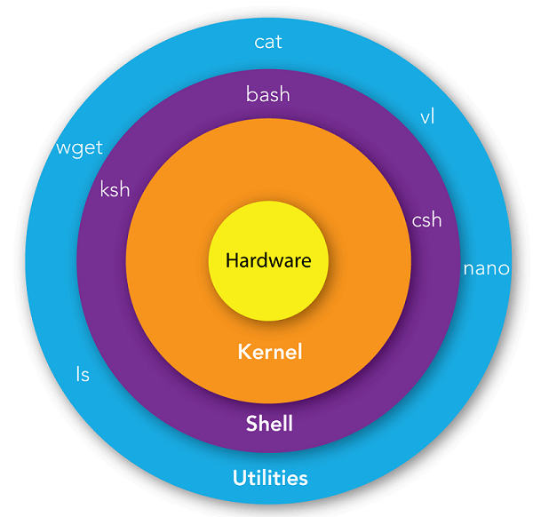

<div class="title-card">
    <h1>Software</h1>
</div>

---

# How do we go from hardware to software?

*How can a computer OS even be created without software? A first-software?*


---

# ROM / Firmware / Bootstrapping / Kernel

1. ROM (Read-Only Memory) is non-volatile memory used to store firmware.

2. Firmware (e.g., BIOS (`B`asic `I`nput `O`utput `S`ystem), UEFI (`U`nified `E`xtensible `F`irmware `I`nterface)) is low-level software that initializes hardware and starts the boot process by loading the bootloader.

3. Booting (from bootstrapping), a process where initial code (in ROM or equivalent) loads the bootloader.

4. The bootloader then loads the kernel, which is the core component of the operating system responsible for managing hardware and software.

---

# Example: MITS Altair 8800

The MITS Altair 8800 was one of the first commercially successful microcomputers.

Bill Gates and Paul Allen used it to create Microsoft's first product: Altair BASIC.



[Source](http://oldcomputers.net/altair.html)

---

# Recommendation: Early British computer history

Micromen is a reference to them being microcomputing pioneers.

[](https://www.youtube.com/watch?v=PiG47g_hu7A)

Also contains the history of how the ARM chip was created.

---

# One View of the Linux Shell

This diagram is one way to view the relation between the hardware, with the kernel on top, the shell and the programs. 



Source - Unknown.

Note that the above diagram shows an operating system with a graphical interface.

---

# Processes

[Daemons](https://en.wikipedia.org/wiki/Daemon_%28computing%29) are programs that run as a background process.

They are usually indicated by a "`d`" at the end of their name.

Some start at boot time and run continuously without user interaction.

*Can you think of a Daemon currently running on your machine related to this course?*

<details> 
  <summary>Answer</summary>
   mysqld. The d shows that it's a daemon.
</details>

---

# See processes

See the process associated with the current shell:

```bash
$ ps
```

See all processes:

```bash
$ ps aux
```

*Can you only list the processes related to Java on your machine?*

<details> 
  <summary>Solution</summary>
   ps aux | grep "java"
</details>


---

# Kill processes

After listing a process you get a process id. 

```bash
$ kill -9 <PID>
```

`-9` means "SIGKILL" = kill the process immediately and forcefully.

*Try to kill your terminal's process*

---

# Process vs. Threads

We will learn about threads soon. 

A program (like your Java programs) run in a single process.

A program can have multiple threads.

Threads are lightweight processes that share the same memory space.

---

# Scheduling

Multitasking: The ability to run multiple processes or threads concurrently. 

It's a necessity since we have more programs than CPU cores.

The CPU is in charge of [scheduling](https://en.wikipedia.org/wiki/Scheduling_%28computing%29) in order to allocate resources and manage the execution of processes and threads.

The modern approach to scheduling involves complex algorithms that do multiple things in order to ensure fairness. 

But there is a value in considering simpler approaches to understand why they do not work and prepare you for common concurrency problems.

---

# Scheduling algorithms

**First come, first serve**

Problem: Convoy effect - short processes wait for long processes.

**Priority scheduling** (The process with the closest 'deadline' will have the highest priority in the queue)

Problem: Starvation - low-priority processes may never get executed.

**Shortest remaining time first**

Problem: Starvation - long processes may never get executed.

**Round Robin**

Problem: Context switching overhead - too many context switches can slow down the system.

**Modified weighted round-robin** (Each process is assigned a weight, and the scheduler selects processes based on their weight)

Problem: Complexity - more complex to implement and manage.


---

# Why learn about scheduling algorithms as a programmer?

