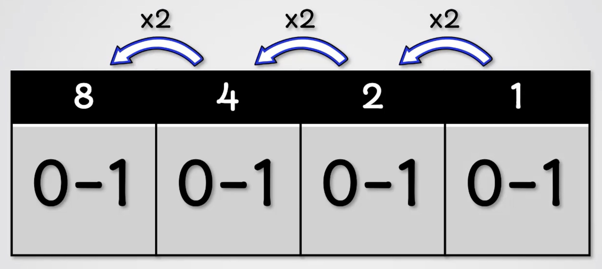

<div class="title-card">
    <h1>Binary</h1>
</div>

---

# Why binary?

Why do we use binary in computers?

<details> 
  <summary>Hint</summary>
  It relates to the hardware.
</details>

---

# Computers are powered with electrical current

Either it is on (`1`) or off (`0`). 

Transistors (electronic switches, ON/OFF) and gates perform logical operations with binary numbers

---

# Logic Gates

https://web.archive.org/web/20240718092358/https://www.algorithm-archive.org/contents/bitlogic/bitlogic.html


https://academo.org/demos/logic-gate-simulator/

---

# Power of 2 Table

| Power | Value | Power | Value |
|-------|-------|-------|-------|
| 2⁰    | 1     | 2⁹    | 512   |
| 2¹    | 2     | 2¹⁰   | 1024  |
| 2²    | 4     | 2¹¹   | 2048  |
| 2³    | 8     | 2¹²   | 4096  |
| 2⁴    | 16    | 2¹³   | 8192  |
| 2⁵    | 32    | 2¹⁴   | 16384 |
| 2⁶    | 64    | 2¹⁵   | 32768 |
| 2⁷    | 128   | 2¹⁶   | 65536 |
| 2⁸    | 256   | 2³²   | 4294967296     |


---

# Binary always doubles in size

Try to sum all the numbers to the right of each bit representation. *What do you notice?*



<details> 
  <summary>Answer</summary>
  The sum of the numbers to the right are always 1 less than the number itself. E.g., 8 - 1 = 4 + 2 + 1
</details>

---

# From most significant bit to least significant bit

[](https://www.youtube.com/watch?v=q5A_OhWdAqU&t=70)


---

# Let's try to convert from decimal to binary

| Most significant | Least significant |
|------------------|-------------------|

|  8. |  7. |  6. |  5. | 4. | 3. | 2. | 1. |
|-----|-----|-----|-----|----|----|----|----|
| 128 |  64 |  32 |  16 | 8  | 4  | 2  | 1  |

Let's try with some numbers:

4, 15, 62, 256

---

# Play this for a bit


[Cisco Binary Game](https://learningcontent.cisco.com/games/binary/index.html)

**Hardmode**: Open your browser console and paste this + hit enter:

```javascript
document.querySelectorAll('.decimal-guide').forEach((element) => {
  element.style.display = 'none';
});
```

---

# Binary addition

<!-- todo: https://www.youtube.com/watch?v=xujT2_3S8KI -->

Same concept as what we learned in school: we carry the 1 over. 
  
| 128 |  64 |  32 |  16 | 8  | 4  | 2  | 1  | Decimal  |
|-----|-----|-----|-----|----|----|----|----|----------|
|  0  |  0  |  0  |  0  | 0  | 0  | 0  | 0  | Number 1 |
|  0  |  0  |  0  |  0  | 0  | 0  | 0  | 0  | Number 2 |
|  0  |  0  |  0  |  0  | 0  | 0  | 0  | 0  | Carry    |
|  0  |  0  |  0  |  0  | 0  | 0  | 0  | 0  | Result   |


---


# From Bits to Bytes

As shown in the table here:

https://en.wikipedia.org/wiki/Byte#Multiple-byte_units

There is a historical difference between decimal units and binary units.

We will follow the modern usage of units such as KB, MB, GB, TB etc. to be 2 to the power of. 

1 Byte = 8 bits

| Binary Units                          |
|---------------------------------------|
| Byte (B) = 1 Byte                     |
| Kilobyte (KiB) = 1,024 Bytes          |
| Megabyte (MiB) = 1,048,576 Bytes      |
| Gigabyte (GiB) = 1,073,741,824 Bytes  |
| Terabyte (TiB) = 1,099,511,627,776 Bytes |


---

# Binary Storage Units (Computing)

| Unit      | Symbol | Equals                               | In Bytes                  |
|-----------|--------|--------------------------------------|---------------------------|
| Kilobyte  | KB     | 2^10 bytes = 1024 bytes              | 1,024                     |
| Megabyte  | MB     | 2^11 KB = 1024 KB = 2²⁰ bytes        | 1,048,576                 |
| Gigabyte  | GB     | 2^12 MB = 2²⁰ KB = 2³⁰ bytes         | 1,073,741,824             |
| Terabyte  | TB     | 2^13 GB                               | 1,099,511,627,776         |
| Petabyte  | PB     | 2^14 TB                               | 1,125,899,906,842,624     |
| Exabyte   | EB     | 2^15 PB                               | 1,152,921,504,606,846,976 |

---

# Let's convert from byte to larger units

**1 byte = 8 bits**

```bash
$ ls -l
```

The values are always shown in bytes. 

*Can you convert to Kilobyte (KB), Megabyte (MB), and Gigabyte (GB)?*

*Discuss in pairs*

<details> 
  <summary>Solution</summary>
  You convert by dividing by 1024 for each step up (e.g., bytes -> KB -> MB -> GB).
</details>

---

<div class="title-card">
    <h1>Hexadecimal (hex)</h1>
</div>

---

# Hexadecimal (hex)

Base 16.

Often indicated with a `0x` prefix.

Since we only have digits `0`-`9`, we use `A`-`F` to represent the values 10-15.

Hex is more readable for humans because 1 hex digit = 4 bits (since 2⁴ = 16).

*How many hex digits is needed to represent `11011011`? What does it say?*

Help: Try to convert it to binary -> decimal -> hex.

<details> 
  <summary>Answer</summary>
   2 x 2^4 = 2 hex digits and `11011011` is represented as `DB` in hexadecimal.
</details>


---


# Hex Colors

|  R  |  G  |  B  | Color | 
|-----|-----|-----|-------|
| 255 | 255 | 255 | White | 
|  0  |  0  |  0  | Black | 

- **00** = 0 (minimum)
- **FF** = 255 (maximum)

*How do you write white and black as hex colors?* 

*Can you figure out the hex values for these colors?*

|  R  |  G  |  B  | Color | Hex Code |
|-----|-----|-----|-------|----------|
| 255 |  0  |  0  | Red   | #??????  |
|  0  | 255 |  0  | Green | #??????  |
|  0  |  0  | 255 | Blue  | #??????  |

[Let's try some more](https://www.w3schools.com/colors/colors_picker.asp)


---

<div class="title-card">
    <h1>Signed vs. Unsigned Integers</h1>
</div>

---

# Signed vs. Unsigned Integers

In MySQL (not SQL) the keyword `UNSIGNED` can define a number type that can't represent negative numbers. 

Many programming languages support declaring an integer as signed or unsigned. 

E.g., in C/C++ there are `int8_t` (signed) and `uint8_t` (unsigned) 8-bit integers.

| Type     | Bit Pattern           | Range       |
|----------|-----------------------|-------------|
| Signed   | [s][7][6][5][4][3][2][1] | -128 to 127 |
| Unsigned | [7][6][5][4][3][2][1][0] | 0 to 255    |

[s] = 0: positive number

[s] = 1: negative number


