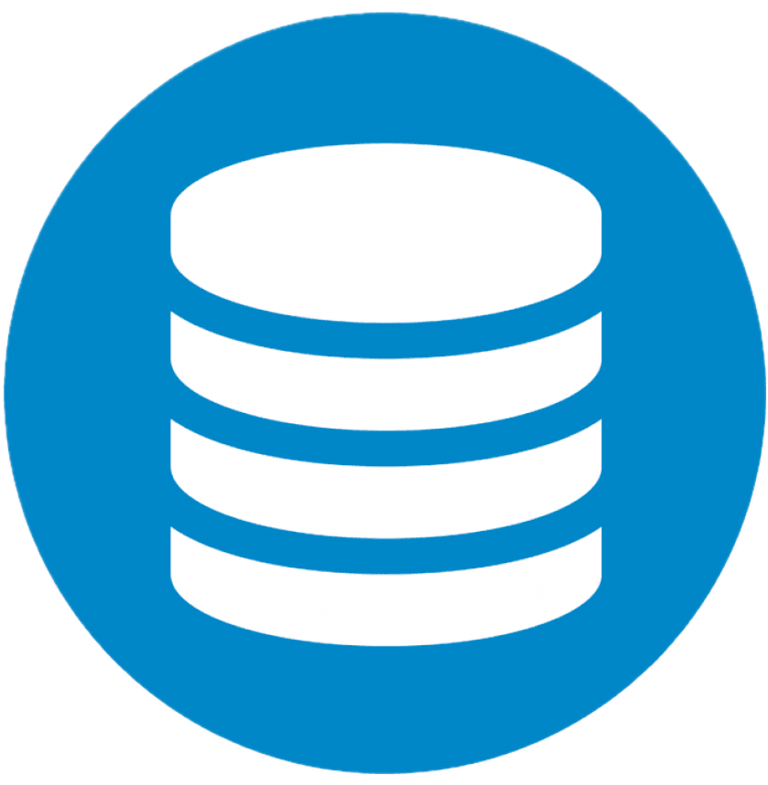
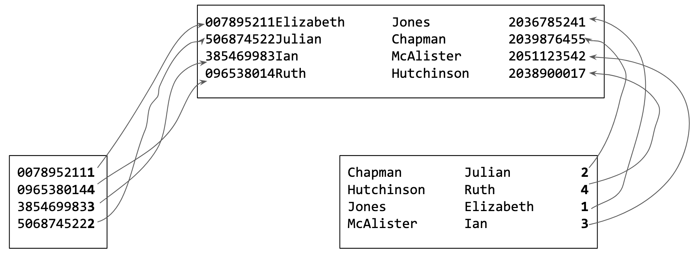
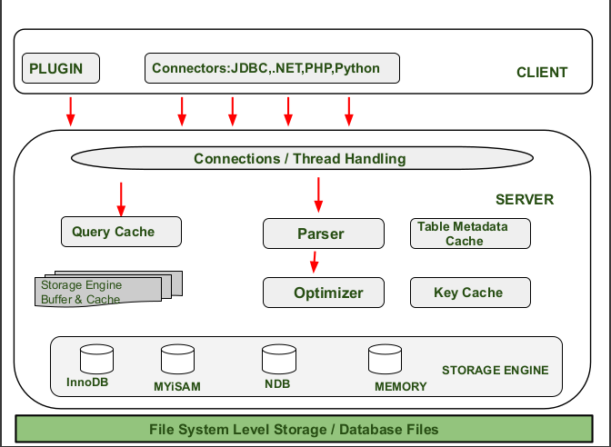

<div class="title-card">
    <h1>Databases</h1>
</div>

---

# Databases are?

A database is a collection of data stored in either:

1. **File storage** (e.g. MySQL = Tech1) (Utilizes memory for caching and retrieving etc.)

  Persists data on disk. Restarting the computer / database would not result in data loss, ideally.

2. **Memory** (e.g. H2 = Programming 3)

  Volatile. Data is lost when the database is restarted.

---

# See databases as structured way to keep data (in files)



[Source](https://toppng.com/free-image/database-database-icon-PNG-free-PNG-Images_218947)

https://stackoverflow.com/questions/2822650/why-is-a-database-always-represented-with-a-cylinder


---

# Ways to store data:

* **Plaintext**: `.txt`, `.csv`, `.json`, `.xml`, `.yaml`.

* **Binary**: `.exe`, `.dll`,`.jpg`, `.png`, `.avi`, `.mp4`, `.mkv`.

And many more. MySQL utilizes binary formats for storing data.

*In your Java world, can you give an example of both a plaintext file format and a binary file format?*

<details> 
  <summary>Answer</summary>
   `.java` is plaintext. `.class` files are binary. 
</details>

---

# Sequential vs. Random Access

**Sequential**

The data is written in consecutive locations. Must run through the file from the start until the data is found:

```plaintext
007895211#Elizabeth#Jones#2036785241$506874522#Julian#Chapman#2039876455$385469983#Ian#McAlister#2051123542$096538014#Ruth#Hutchinson#2038900017%
```

**Relative/Random/Direct access**

The size of each record is fixed, allowing for direct access to any record without reading previous ones:

```plaintext
007895211Elizabeth      Jones          2036785241
506874522Julian         Chapman        2039876455
385469983Ian            McAlister      2051123542
096538014Ruth           Hutchinson     2038900017
```

---

# Indexed data - Multiple files



---

# Advice: Don't be stingy!

Assign sufficient space for each column. Students are often too stingy with the space.

Storage space is incredibly cheap while migrating a database (changing schemas) is troublesome and extremely costly in production.

---

# Database Paradigms

https://db-engines.com/en/ranking

| Paradigm         | Description                                 | Example DBMS         |
|------------------|---------------------------------------------|-----------------------|
| Relational       | Structured tables with rows and columns     | PostgreSQL, MySQL     |
| Document         | Stores JSON-like documents                  | MongoDB, CouchDB      |
| Key-Value        | Simple key-value pairs                      | Redis, DynamoDB       |
| Wide-Column      | Column families with flexible schemas       | Cassandra, HBase      |
| Graph            | Nodes and edges for relationships           | Neo4j, ArangoDB       |
| Object-Oriented  | Stores objects with attributes/methods      | db4o, ObjectDB         |
| Time-Series      | Optimized for time-stamped data             | InfluxDB, TimescaleDB |
| Multimodel       | Supports multiple paradigms                 | ArangoDB, OrientDB    |
| Hierarchical     | Tree-like structure                         | IBM IMS               |
| Network          | Flexible graph-like structure               | Integrated Data Store |

---

# Database Management Systems (DBMS) (with MySQL examples):

1. Data

2. Access Interface:
  - A query language (e.g. SQL) 
  - CLI (Command-Line interface) (e.g. MySQL Shell)
  - GUI (Graphical User Interface) (e.g. DataGrip, IntelliJ, MySQL Workbench)

3. Connectivity layer
  - Driver (e.g. JDBC)

4. Utilities (for instance for backup, performance / statistics tools, monitoring / logging, scheduling, access control)

---

# Access Interface vs. Connectivity layer

*What is the major difference between category `2` and `3` in the previous slide?*

<details> 
  <summary>Answer</summary>
   2 categorizes human interaction. 3 categorizes programmatic interface. 
</details>


---

# Relational Databases vs. NoSQL

NoSQL is a horrible term that throws a lot of database paradigms into one category in opposition to relational databases.

---

# Examples of SQL databases

There are many types of SQL databases. This semester you will use MySQL but you should consider choosing a different one.

- PostgreSQL
- SQLite
- MariaDB (community-developed fork of MySQL)
- MySQL
- Microsoft SQL Server (MSSQL)
- Oracle Database

MySQL supports multiple storage engines such as: `InnoDB` (default), `MyISAM`, `MEMORY` and more.

While there are some syntactical differences between them, learning SQL is a transferable skill towards learning other SQL databases.

---

# MySQL Architecture




[Source](https://www.geeksforgeeks.org/mysql/architecture-of-mysql/)
