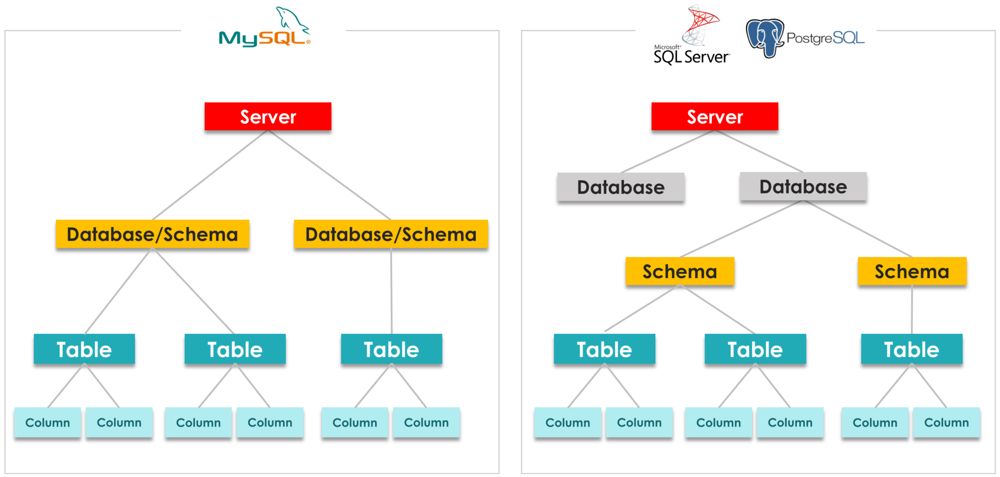
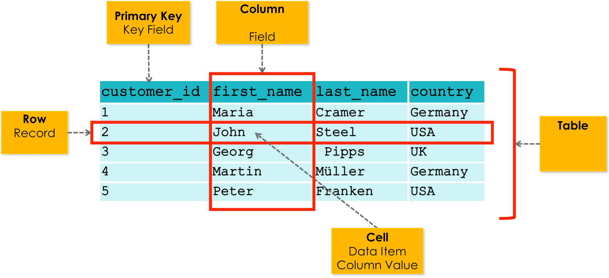

    <h1>SQL</h1>

---

# SQL

**S**tructured **Q**uery **L**anguage

The language used to communicate with SQL databases.

Declarative instead of imperative. You specify **WHAT** you want, not **HOW** to get it.

For instance: I want the last name of all users with the name "Grace". You don't have to specify what instructions must be followed to retrieve that data.

*Do you know know any other declarative languages?*

---

# Database Components

[Source](https://www.datawithbaraa.com/sql-introduction/sql-database-concept/)

---

# Table Components

[Source](https://www.datawithbaraa.com/sql-introduction/sql-tables/)

---

# DCL vs. DML vs. DDL vs. TCL

Sorry about the W3Schools link:

https://www.w3schools.in/mysql/ddl-dml-dcl

In this course we will focus on `DDL` and `DML`.

`DDL` (Data **Definition** Language): We define our schema.

`DML` (Data **Manipulation** Language): We manipulate our data.

---

# SQL Data Types

https://www.w3schools.com/sql/sql_datatypes.asp

https://www.digitalocean.com/community/tutorials/sql-data-types

https://dev.mysql.com/doc/refman/8.0/en/data-types.html

