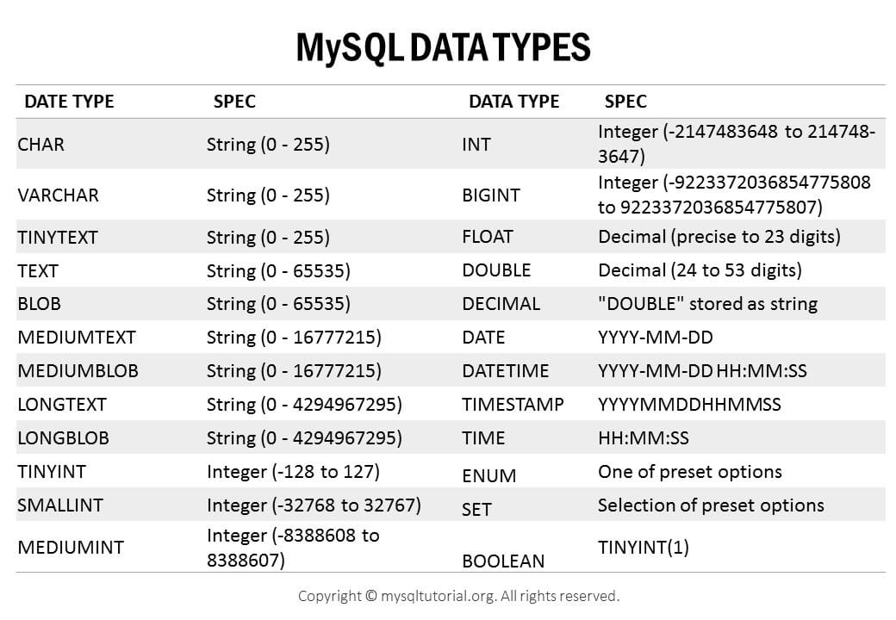

<div class="title-card">
    <h1>DDL</h1>
</div>

---

# MySQL command-line client

Log into MySQL via the command line:

```bash
$ mysql -u <username> -p
```

A common username is `root`.

Windows users if you have not added the MySQL `bin` directory to your `PATH` environment variable, try:

```powershell
$ "C:\Program Files\MySQL\MySQL Server 8.0\bin\mysql.exe" -u username -p
```

Or open "MySQL Command Line Client" from the Start Menu.

---

# Create a Database (SCHEMA)

```sql
CREATE DATABASE my_database;
```

Or

```sql
CREATE SCHEMA my_database;
```

---

# Delete the Database

```sql
DROP DATABASE my_database;
```

---

# DDL Overview

Create a database, table or index:

```sql
CREATE
```

Change the table structure (columns / data types):

```sql
ALTER
```

Delete a database (including all tables), delete all tables (including all data), delete a column, delete index:

```sql
DROP
```

Delete all the data in a table but not the table itself:

```sql
TRUNCATE
```

Change the name of a table or column:

```sql
RENAME
```

---

# Log into MySQL CLI

Run the following in your terminal (skip if MySQL Command Line Client immediately connects to your database):

```bash
$ mysql -u username -p
```

Try writing:

```sql
> SHOW DATABASES
```

Notice that the prompt symbol is `>` and not `$` which indicates that the command should be run in the MySQL CLI.

*What happens and why?*

**Hint**: The sentence before the question.

---

# MySQL requires semicolons after each statement

It wont immediately give you a syntax error like Java.

*Add a semi-colon, press `Enter` and see that it returns to the prompt.*

Let's go inside of the default `mysql` database (with the `USE` command) and see the tables inside of it afterwards:

```sql
> USE mysql;
> SHOW TABLES;
```

---

# Fun assignment

What will it say if you type either one of the following. 

```sql
> QUIT
-- OR
> EXIT
```

**SHOUT it out in the classroom!**

---

# Create the database in MySQL CLI

Assuming that you are already logged in:


```sql
> CREATE DATABASE video_games;
```

---

# Let's open DataGrip and connect to our MySQL database

2. Open DataGrip.

3. Click on "Add New Data Source" and select "MySQL".

4. Enter your database connection details (host, database, port, user, password).

5. Click "Test Connection" to ensure everything is working. (Download the JDBC driver the first time).

6. Click "OK" to save the connection.

---

# Conventions about naming

The most important thing is **consistency**. You will find that many online examples are all over the place. If you can follow these rules:

- Use snake_case for database, table, and column names.
- Use plural nouns for table names as they hold multiple rows of that item.
- Use descriptive names that clearly indicate the purpose of the table or column.
- Use lowercase letters.

When writing the SQL queries you don't *need* to write keywords in uppercase but it improves readability because it visually separates the keywords from parts of the query that are variables that you named.

Example:

```sql
> CREATE DATABASE video_games;
```

*How many keywords are there? What are they? What is the variable name?*

---

# Let's design our `video_games` table first

**Assignment**: Design the database. 

Before you begin, you should always design your database thoroughly. You will learn this in **Systemudvikling**.

There, you will also learn to make database diagrams. For now, you can represent it any way you like: Spreadsheet, pen and paper, text file, diagram, image etc. The point is for you to think about the content of the database and write it down.

Each person will end up with different columns in their table and that's okay.

We know that we want to store information about video games. What data do we want to store?


---

# Let's try to create a minimal table in our new database

```sql
USE video_games;

CREATE TABLE games (
    title VARCHAR(250) NOT NULL
);
```

---

# Let's try to add a studio column

```sql
CREATE TABLE games (
    title VARCHAR(250) NOT NULL,
    studio VARCHAR(100) NOT NULL
);
```

And run it. 

*What happens?* 

*Why?*

---

# We can't create a table that already exists

If it started to recreate the table from scratch when the table already exists then it would have to delete all the data in the table first. That would be dangerous. 

To never see the error message we can attach the following:

```sql
CREATE TABLE IF NOT EXISTS games (
  -- ...  (By the way, this is an SQL comment)
);
```

But if we want to delete the table and its data and start over we can run the following statement:

```sql
DROP TABLE games;
```

(The `ALTER` keyword can be used to modify tables, columns and indexes.)

---

# Drop it twice

Try running it twice:

```sql
DROP TABLE games;
DROP TABLE games;
```

*What happens and why?*

**Assignment**: Try to solve it without looking it up. You have all the information already.

<details> 
  <summary>Solution</summary>
   DROP TABLE IF EXISTS games;
</details>

---

# MySQL Data Types

**Assignment**: Extend your database design by adding column type based on the image below.

We know that we want to store information about video games. What can we infer about the data that we store?



[Source](https://www.mysqltutorial.org/mysql-basics/mysql-data-types/)

---

# Not *the* solution

We will probably do something else in class but in case you are going back to refresh the material and want to follow along the next couple of slides yourself here is one example:

```sql
USE video_games;

CREATE TABLE games (
    id INT AUTO_INCREMENT PRIMARY KEY,
    title VARCHAR(250) NOT NULL,
    release_date DATE NOT NULL,
    purchased_units INT NOT NULL
);
```
