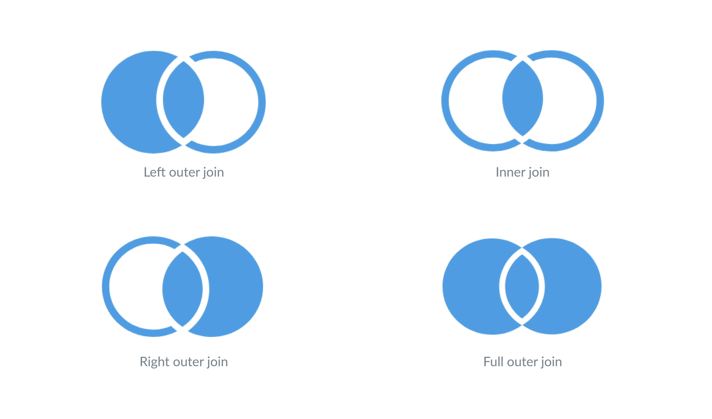

    <h1>JOIN</h1>

---

# Motivation

We have two tables: `games` and `studios`.

Based on what we learned last week:

1. We would need to make two separate `SELECT` to each table to get all the data out. 

2. And then we would have to combine the data in the application layer. 

Thanks to our newly created relation (with foreign key) we can use `JOIN` to combine it all into a single query.

**Learning Goal**: You should understand different joins conceptually, be able to write them by looking them up, be able to read the syntax and have the ability to use AI to generate JOIN queries. You should not be so indifferent to the syntax, however, that you cannot debug the statements.

---

# JOIN

[Source](https://www.metabase.com/learn/sql/working-with-sql/sql-join-types)

---

# Perform a `JOIN` between `games` and `studios`

Let DataGrip intellisense help you get the structure right.

---

# Using Inner Joins in MySQL

---

# Assignment: Recreate the example

1. Recreate the two tables from the previous video.

2. Add some example data to it.

3. Create the inner join query.

---

# Using Outer Joins in MySQL

---

# Assignment: Create the outer join query

1. Create the outer join query from the previous video.

---

# There are more JOINs

You don't need to learn them but just to bring awareness to them:

**Self Join**: Join a table to itself.

**CROSS JOIN**: Return all combinations of rows from both tables.

---

# Datalemur (Spotify Example)

Follow along with the tutorial here:

https://datalemur.com/sql-tutorial/sql-joins-inner-outer-left-right

