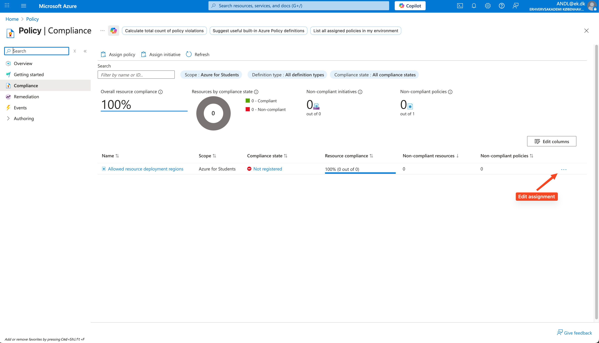
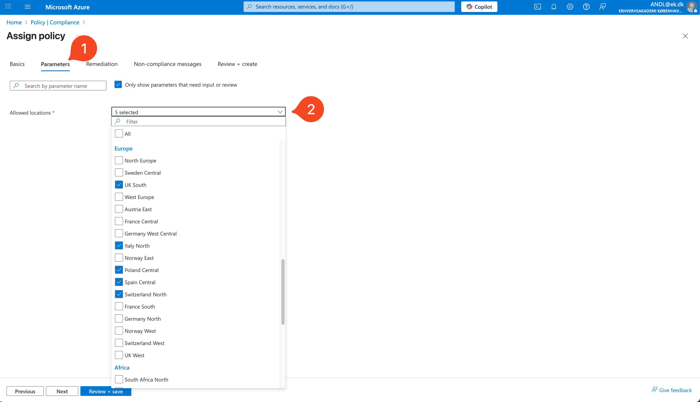
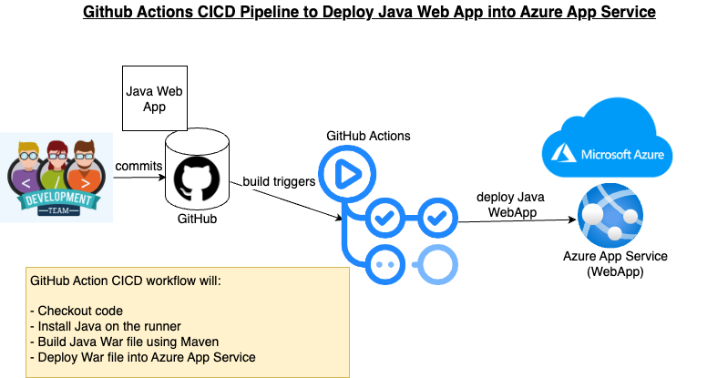

<div class="title-card">
    <h1>Let's create a Spring Boot application</h1>
</div>

---

# Project Outline

We will do the same project as one of your parallel classes: `countries`.

The website will be able display countries.

This is the same as the previous assignment where you had to expand the list and correct it. You can use your solution to expand this solution.

**Agenda: This Week**:

1. Setup a Spring Boot project

2. Deploy it to Azure

**Agenda: Next Week**:

1. Setup database and add it to the Spring Boot project

2. Deploy a database to Azure

---

# Create a GitHub Repository

1. Go to GitHub and create a new repository

2. Clone it locally

3. Open it in IntelliJ IDEA

---

# Create a Spring Boot Project I

In IntelliJ IDEA:

1. `File` -> `New` -> `Project`

2. Select `Spring Initializr` (In the left sidebar)

3. Give the project a name (e.g. `countries`)

4. For `Location` select the folder of your cloned repository

5. For `Type` select `Maven`

6. Select `JDK` 21 (Download if needed)

7. Click `Next`

---

# Create a Spring Boot Project II

1. Add the following dependencies:

> **Developer Tools**: `Spring Boot DevTools`

> **Web**: `Spring Web`

> **Template Engines**: `Thymeleaf`

> **SQL**: `JDBC API` and `MySQL Driver`

2. Click `Create`

**Note**: IntelliJ's Spring Initializr creates the project in a subfolder with the same name as the project. 

---

# Example dependencies snippet from `pom.xml`

```xml
	<dependencies>
		<dependency>
			<groupId>org.springframework.boot</groupId>
			<artifactId>spring-boot-starter-jdbc</artifactId>
		</dependency>
		<dependency>
			<groupId>org.springframework.boot</groupId>
			<artifactId>spring-boot-starter-thymeleaf</artifactId>
		</dependency>
		<dependency>
			<groupId>org.springframework.boot</groupId>
			<artifactId>spring-boot-starter-web</artifactId>
		</dependency>

		<dependency>
			<groupId>org.springframework.boot</groupId>
			<artifactId>spring-boot-devtools</artifactId>
			<scope>runtime</scope>
			<optional>true</optional>
		</dependency>
		<dependency>
			<groupId>com.mysql</groupId>
			<artifactId>mysql-connector-j</artifactId>
			<scope>runtime</scope>
		</dependency>
		<dependency>
			<groupId>org.springframework.boot</groupId>
			<artifactId>spring-boot-starter-test</artifactId>
			<scope>test</scope>
		</dependency>
	</dependencies>
```

---

# IntelliJ's Spring Initializr creates the project in a subfolder

But Azure expects `pom.xml` to be in the root of the repository.

Move all files and folders from the subfolder to the root of the repository.

---

# Setup the Application as a Maven Project

1. Right click the **Java** folder `src/main/java` and in the context menu select `Mark Directory as` -> `Sources Root`

This should make the folder blue in the project explorer.

2. Right click on the `pom.xml` file and select `Add as Maven Project`

You should see an `m` icon pop-up in the right sidebar of IntelliJ IDEA. Expand it. 

3. In the `Lifecycle` section double click `clean` and then `install`.

**Note**: The install step will fail!

---

# Exclude the Database configuration

Since we do not have a database yet, we need to exclude the database configuration for now.

In the Main class file import the following:

```java
import org.springframework.boot.autoconfigure.jdbc.DataSourceAutoConfiguration;
```

And above the Main class file replace the `@SpringBootApplication` annotation with:

```java
@SpringBootApplication(exclude = {DataSourceAutoConfiguration.class})
```

Try to run install again and it should work.

---

# Create a Controller

1. Create a folder named `controllers` in the `src/main/java/<your package>` folder.

2. Create a class named `WelcomeController` in the `controllers` folder.

3. Add the following code to the `WelcomeController` class:

```java
@RestController
public class WelcomeController {

    @GetMapping("/")
    public String welcome(Model model) {
           return "Welcome to the countries website!";
    }
}
```

---

# Run the Application

Access it on `http://localhost:8080/`

You should see the text `Welcome to the countries website!`

---

# Commit and Push

1. Commit your changes

2. Push to GitHub

We are now ready to deploy the application to Azure!

---

# Available regions

Since KEA became EK, Azure for Students accounts have become limited in regards to available regions.

Each student can only deploy to 5 regions and **it differs for each student**!

You need to look up which regions you can deploy to and choose one of them.

You also cannot change the available regions.

---

# The Azure Portal Method I

1. Go to [this link](https://portal.azure.com/#view/Microsoft_Azure_Policy/PolicyMenuBlade/~/Compliance) after being logged in to your Azure For Students account with your `ek` mail.

2. You will see a row representing policies for your Azure for Students account. Click on the three dots on the right and select **Edit Assignment**:



---

# The Azure Portal Method II

3. Choose the **Parameters** tab and expand the dropdown. You will see the available regions.



**Note**: Your available regions will differ from the screenshot above.

---

<div class="title-card">
    <h1>CI/CD</h1>
</div>

---

# GitHub Actions? CI/CD?

*Remember what these were? We've gone through this.*

---

# GitHub Actions Refresher

Remember that we were able to execute code in GitHub Actions? 

This is an extra step to refresh your memory. This will not be necessary for the exam project.

Let's set up a workflow that tries to build our Spring Boot project using Maven so that we know it works.

1. Go to the `Actions` tab in your GitHub repository and select `New workflow` in the left sidebar.

2. Choose the suggested workflow: `Java with Maven`. Click on `Configure`.

3. Look at the code and see if you can understand it. Once you are satisfied, click on `Commit changes...`. 

---

# CI/CD with Azure App Service + GitHub Action



[Source](https://www.cidevops.com/2024/04/github-actions-cicd-pipeline-to-deploy.html)

**Note**: In our case we build Jar files instead of War files.

---

# Let's locate, download and run the jar file locally

In the `GitHub Actions` tab we can click on a run and download the Artifact under `Artifacts`. 

Extract it locally and run this in your terminal:

```bash
$ java -jar countries-0.0.1-SNAPSHOT.jar
```

---

# Exercise for after CI/CD Setup is complete

Set up a welcome page with Thymeleaf. Push and check the deployed result.