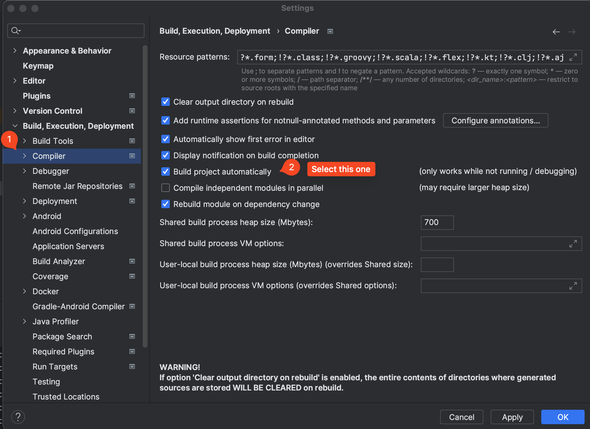
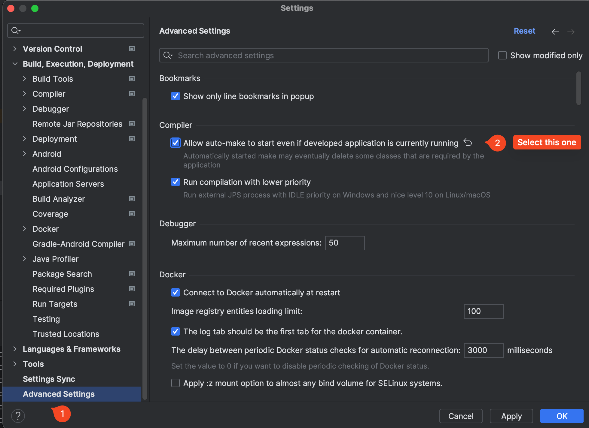

# How To Get Hot Swap with Spring in IntelliJ

Hot Swap will try to reload parts of your application (that have changed) without restarting it all. 

The benefit is that it can significantly speed up the development process, especially with heavier applications that take a long time to start up.

The worst case scenario is that it doesn't work, your server stops and you have to manually run it again.

**Note**: You might find some older tutorials online mentioning changing `registry...`. This is no longer valid in IntelliJ.

---

## Step 1: Add the `spring-boot-devtools` dependency

Inside of the `<dependencies></dependencies>` tag in your `pom.xml`, add the following dependency:

```xml
		<dependency>
			<groupId>org.springframework.boot</groupId>
			<artifactId>spring-boot-devtools</artifactId>
			<optional>true</optional>
		</dependency>
```

Remember to refresh/reload the project/install the dependency.

---

# Step 2: Enable Automatic Build

In IntelliJ, go to `File -> Settings -> Build, Execution, Deployment -> Compiler` and enable the option `Build project automatically`. This will ensure that your project is rebuilt automatically when you make changes to the code.



---

# Step 3: Allow rebuild even when running

In IntelliJ, go to `File -> Settings -> Advanced Settings` at the very bottom of the left pane and enable the option `Allow auto-make to start even if developed application is currently running`. This will allow the application to be rebuilt while it is running, enabling Hot Swap.



---

# Step 4: Success

You might need to restart IntelliJ.

1. Run your application as you normally would.

2. Make a change and refresh your browser to test it out.