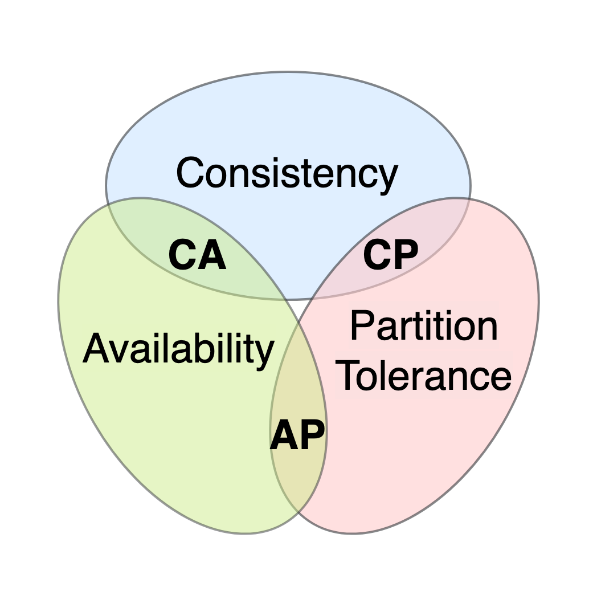
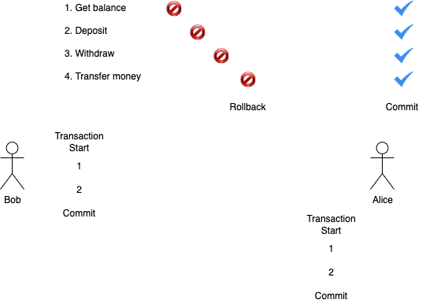

    <h1>Database Transactions</h1>

---

# Time to get pessimistic!

*When working with databases, what could go wrong?*

Here are some categories to help you answer:

**Infrastructural Failures**:

What could go wrong outside of the database?

**Resource Issues**:

What could go wrong with the resources available to the system?

**Application Logic Errors**:

What could go wrong with the code?

**Data Integrity Issues**:

What could go wrong with the data?

(A lot could go wrong. The next slide is only a selection.)

---

# Examples of Things that Could Go Wrong

**Infrastructural Failures**

System crashes, power outages, network issues, hardware failures.

**Resource Issues**

Memory exhaustion, connection pool limits (too many connections), disk space limits, timeouts.

**Application Logic Errors**

Business logic errors, incorrect assumptions about data, failure to handle edge cases.

**Data Integrity Issues**

Constraint violations, inconsistent data across tables, orphaned records, partial inserts/updates, duplicate records (from retries).

---

# Concurrency Issues

There is a whole new category of issues when dealing with concurrency. 

| Concurrency Issue | Description |
|-------------------|-------------|
| Dirty reads | Reading uncommitted data |
| Non-repeatable reads | Data changes between reads |
| Phantom reads | New rows appear between queries |
| Lost updates | Concurrent writes overwrite each other |
| Deadlocks | Transactions waiting on each other |

---

# Let's play a resource stealing game

**The Table**: My Application, ---- **The Board**: My Database

1. I will write down the total `X` of candy resources I have on the board (**DB**).

2. I will walk over to the table (**Application**) and place the candy.

3. First person to take a candy will trigger me to walk towards the board (**DB**) to update the count. 

4. Everyone is free to steal 1 candy. I will focus on updating the count and can't hear or see anything else happening.

5. After updating the board (**DB**) I will walk back to the table (**Application**) and state that 1 candy was taken and say the number aloud: `X - 1 = Y`.

---

# Read-Modify-Write Cycle

Here is a bank example where everything works as expected.

| Bob | Bank |
|-----|------|
| Reads the balance (**1000 DKK**) | |
| Withdraws **100 DKK** | |
| | Updates the withdrawal to the balance |

**Balance:** ???

  
Answer

    900 DKK

---

    <h1>Seat Reservation</h1>

---

# Seat Reservation: Lost Update

The timeline goes downwards. First row is first operation:

| Customer 1 | Customer 2 |
|------------|------------|
| Reads Seat A1 available | |
| | Reads seat A1 available |
| Books seat A1 | |
| | Books seat A1 |

 

  
What is the problem?

    Customer 2's booking overwrites Customer 1's booking.

---

# Seat Reservation: Dirty Read

| Time | Transaction 1 (Customer 1) | Transaction 2 (Customer 2) |
|------|---------------------------|---------------------------|
| 1 | Books seat B2 (uncommitted) | |
| 2 | | Reads seat B2 as booked |
| 3 | Cancels booking (rollback) | |
| 4 | | Makes decision based on B2 booked |

 

  
What is the problem?

    Decision based on uncommitted (“dirty”) bookings – may be rolled back.

---

# Seat Reservation: Non-Repeatable Read

| Time | Transaction 1 (Customer 1) | Transaction 2 (Customer 2) |
|------|---------------------------|---------------------------|
| 1 | Checks seat C10: available | |
| 2 | | Books seat C10 and commits |
| 3 | Checks seat C10 again |  |

 

  
What is the problem?

    Customer sees different availability for the same seat within a single transaction

---

# Seat Reservation: Phantom Read

| Time | Transaction 1 (Customer 1) | Transaction 2 (Admin) |
|------|---------------------------|----------------------|
| 1 | Searches row D, sees 3 seats available (D1, D2, D3) | |
| 2 | | Admin adds 2 extra seats: D4, D5, and commits |
| 3 | Searches row D again, now sees 5 seats available (phantom seats D4, D5 appeared) |  |

 

  
What is the problem?

    New (phantom) seats appearing during transaction

---

# More potential problems with missing concurrency control

**Partial Update** (Atomicity Violation): If the balance update succeeds but the transaction record insertion fails (or vice versa), the data will be inconsistent—money might be debited without a transaction record or logged without affecting the balance.

**Deadlocks**: Simultaneous transactions could lock rows in both tables in conflicting orders, causing deadlocks.

**Inconsistent State During Failure**: If the transaction fails midway due to system crash or network issues, without rollback, the data can remain in an inconsistent or corrupt state.

**Race Conditions**: Two withdrawals happening simultaneously from the same account could both succeed, allowing overdraft by permitting the balance to go negative without proper checks and locks.

---

# Conflict Serializability

Another way to think about concurrency issues.

Rules:

* ✅ If two transactions only read a data item, they do not conflict and order is not important.

* ✅ If two transactions either read or write completely separate data items, they do not conflict and order is not important.

* ⛔ If one transaction writes a data item and another either reads or writes the same data item, the order of execution is important.

---

    <h1>Bank Scenarios</h1>

---

# Bank example: Lost Update Problem

Bob withdraws money twice.

The bank has not updated the balance in time so it reads the first balance and when Bob withdraws a second time he withdraws from the original amount.

| Bob | Bank |
|-----|------|
| Reads the balance (**1000 DKK**) | |
| Withdraws **100 DKK** | |
| Re-reads the balance (**1000 DKK** - stale!) | |
| | Updates to **1000 - 100** = **900 DKK** |
| Withdraws **100 DKK** | |
| | Updates to **??? - 100** = **??? DKK** |

**Bank Balance:** ???  ----  **Bob's Illicit Gains**: ???

  
Answer

    Bank Balance: 900 DKK, Bob's Illicit Gains: 100 DKK

---

# Scenario 1: ATM

Can you unlock all the achievements?

https://anderslatif.github.io/transactions/

Can you write down the series of operations to:

1. Create the `By the Book` achievement? (An ideal transaction)

2. Make Bob steal `100 DKK` from the bank?

3. Earn the bank `100 DKK` from Bob?

---

# Scenario 2: Multiple Bank Accounts I

Scenario 2 is about having multiple accounts (rows) in a single table.

**Starting:** Alice = 1000 DKK, Bob = 1000 DKK, Bank = 0 DKK

| Alice | Bob | Bank |
|-------|-----|------|
| Transfers 100 DKK to Bob | | |
| | | Debits Alice 100 DKK |
| | | Credits Bob 100 DKK |

**Result:** Alice = 900 DKK, Bob = 1100 DKK, Bank = 0 DKK ✅

---

# Scenario 2: Multiple Bank Accounts II

**Starting:** Alice = 1000 DKK, Bob = 1000 DKK, Bank = 0 DKK

| Alice | Bob | Bank |
|-------|-----|------|
| Transfers 100 DKK to Bob | | |
| | | Debits Alice 100 DKK |
| | | (Crash before credit) |

**Result:** Alice = 900 DKK, Bob = 1000 DKK, Bank = 100 DKK (Bank stole 100!) ⛔

---

# Answer `YES` or `NO`

To avoid problems, do we want the following to be true?

*The transfers must either both succeed or both fail?*

*We want eventual consistency, not immediate, as long as it eventually enters a valid state?*

*Multiple concurrent transactions are allowed to interfere with each other?*

*A transaction must be durable, that is, it must be stored permanently once completed?*

  
Answers

    Yes, No (that's BASE), No, Yes

---

# ACID

What you just answered are questions related to the [ACID](https://en.wikipedia.org/wiki/ACID) and BASE properties of databases.

| Property        | Description                          |
|-----------------|--------------------------------------|
| **A**tomicity   | All or nothing transaction           |
| **C**onsistency | Valid state before and after         |
| **I**solation   | Transactions don't interfere         |
| **D**urability  | Changes persist after commit         |

While **ALL** SQL databases are ACID-compliant, some NoSQL databases are BASE-compliant instead...

Great overview: [ACID vs. BASE](https://aws.amazon.com/compare/the-difference-between-acid-and-base-database/).

---

# BASE

| Property          | Description                             |
|-------------------|-------------------------------------|
| **Basically Available**| System is available for requests    |
| **Soft State**        | Data state can change over time     |
| **Eventual Consistency**| Data becomes consistent eventually |

Case Study: [MongoDB](https://www.mongodb.com/), which supports replicating data across regions.

If a local server goes down, other servers can still handle requests, so the system is **basically available**.

They are in a **soft state** because outside of transactions, even without any input, the data may change as replicas synchronize.

It's possible to write to a single replica and have MongoDB synchronize them to ensure **eventual consistency**.

---

# CAP Theorem

A fundamental principle in distributed database systems. According to the CAP theorem, a database can satisfy two of the three guarantees of **consistency**, **availability**, and **partition tolerance** (still functional if parts of the system are unavailable).

[Source](https://en.wikipedia.org/wiki/CAP_theorem)

**MySQL**: achieves consistency and availability

**MongoDB**: achieves availability and partition tolerance

---

# Scenario 3: Multiple Tables

Notice that `Scenario 1` (single account) violated the data integrity of a single row and `Scenario 2` (multiple accounts) violated the data integrity of multiple rows in a single table. Let's call that table: `bank_transactions`.

Let's consider violating the integrity of multiple tables.

Consider a transaction that involves two tables: `bank_accounts` (which contain a balance field that needs to be updated) and `bank_transactions` (which contain a record of all transactions).

*What could go wrong here?*

*How can we solve the problem with having to update a value in multiple tables?*

  
One partial solution

    Another argument for normalization! It will avoid duplicated data across tables but we will still have concurrency issues.

---

# Let's summarize potential problems possible for the 3 scenarios

1. 1st scenario: Single table, single operation type (withdrawal/deposit). Issues: lost updates, dirty reads

2. 2nd scenario: Single table, multiple operation types (transfer). Issues: partial updates, lost updates, dirty reads

3. 3rd scenario: Multiple tables (accounts and transactions). Issues: partial updates, lost updates, dirty reads, inconsistent state

---

    <h1>Database Transactions</h1>

---

# Transactions

The solution has arrived: Transactions (`TX`)!

A database transaction is a sequence of operations performed as a single logical unit of work.

Transactions must satisfy the ACID properties to ensure data integrity, even in the presence of errors, power failures, or other unexpected issues.

We ensure that a transaction is committed before we start another one.

---

# Seat Reservation: Fixed with Transactions

The timeline goes downwards. First row is first operation:

| Customer 1 | Customer 2 |
|------------|------------|
| BEGIN TRANSACTION | |
| Reads Seat A1 available | |
| Books seat A1 | |
| COMMIT | |
| | BEGIN TRANSACTION |
| | Reads seat A1 (now unavailable) |
| | Booking fails or selects different seat |
| | COMMIT |

Customer 2 cannot access and read the seat until Customer 1 has completed their transaction.

